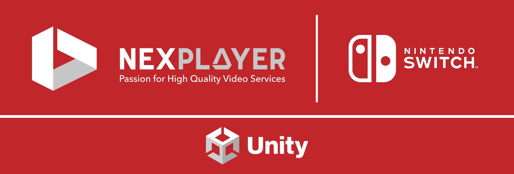

<h1 style="line-height:2;">
<a href="https://nexplayersdk.com/nintendo-player-sdk/" target="_blank"></img></a>
 

  
</h1>
  
   

  NexPlayer™ SDK for Nintendo Switch™ enables Live & video on demand (VOD) streaming inside Nintendo Switch apps and games made with Unity. It can be easily integrated into any **native** or **Unity** apps. The player was developed in collaboration with the native [NexPlayer SDK](https://nexplayersdk.com/) and utilizes many of its features such as intelligent ABR, HLS, DASH, customizable APIs, and more.

  Our Nintendo Switch video player opens the door for new use cases, such as live video content embedded within the game universe or OTT providers to offer their Live & VOD video services to Nintendo Switch users.
  
  * **The only Video Streaming Player SDK for Nintendo Switch**

  This repository contains the feature list of our Nintendo Switch video streaming player with Unity. If you want to get a copy of our fully working demo, contact us at our [website](https://nexplayersdk.com/nintendo-player-sdk/).
  

    
   

  ## Use Case Examples
  
   

  
<b>NexPlayer powers Jeopardy!® Playshow on Nintendo Switch™. <a href="https://nexplayersdk.com/nexplayer-powers-jeopardy/">Read more</a>
  

  
<b>Live & VOD video streaming inside Unity games for Nintendo Switch</b>

   

  
Our Unity video player for Nintendo Switch allows for the introduction of video streams within your Unity games for Switch. With our library, you can use in-game actions to control the video playback.

   

  -------------------

  ## Table of Contents
  
  * **[Features](#features)**
  
  * **[Contact](#contact)**

    
  
  ## Features
  
  Our Unity video player for Nintendo Switch supports the following features:
  
  <table>
   <tbody style="text-align:center;">
     <tr>
       <td valign="top" style="text-align:center;">
           
<b>Overview</b>

       </td>
       <td>
         <ul>
         <li>Easy to integrate into any native or Unity app</li>  
         <li>HLS & DASH Streaming with ABR (Adaptive Bitrate)</li>
         <li>AES 128 content protection</li>
         <li>Customizable API</li>
         <li>Closed Captioning and Subtitle Formats (WebVTT, TTML, CEA-608)</li>
         <li>Audio Track Selection</li>
         </ul>
       </td>
          <tr>
              <td valign="top" style="text-align:center;">
              
<b>Basic Features</b>

       </td>
       <td>
         <ul>
          <li>Play / Pause / Stop / Manage Audio Volume / Seek</li>
         </ul>
       </td>
       </tr>
     </tr>
   </tbody>
  </table>
  
   

  ## Contact
  [nintendo@nexplayer.com](mailto:nintendo@nexplayer.com)
   +34 914 184 356
  
   
  Nintendo Switch is a trademark of Nintendo.
  
   
  Unity video player for Switch, Unity video player for Nintendo Switch, Video player for Nintendo Switch games with Unity, Unity video streaming Nintendo Switch, Video streaming and playback in Switch games with Unity, Video playback Switch, Video playback on Nintendo Switch, Video Player for Nintendo Switch, Video Player Nintendo Switch, metaverse, Mario Kart 8 Deluxe, Nintendo, Animal Crossing: New Horizons, Super Smash Bros. Ultimate, The Legend of Zelda, Super Mario, Pokemon, New Super Mario Bros. U Deluxe, Pokémon GO, Dragon Ball FighterZ, Mario Party Superstars, Bandai Namco, Nintendo EPD, Game Freak, NDcube, movie libary, NintendoSDK, Media player for Switch.
  
