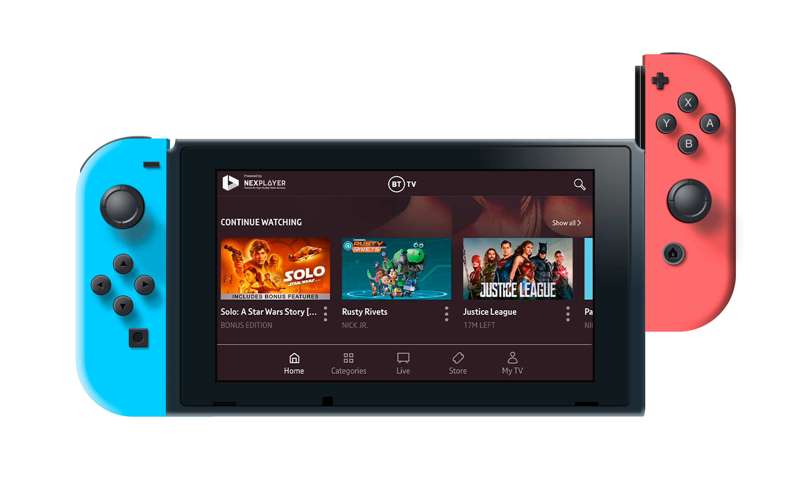

<h1 style="line-height:2;">
<a href="https://nexplayersdk.com/nintendo-player-sdk/" target="_blank"></img></a>
  
  
</h1>
  
   

  NexPlayer™ SDK for Nintendo Switch™ enables Live & VOD video streaming inside Nintendo Switch apps and games. It can be easily integrated into any **native** or **Unity** app. The player was developed in collaboration with the native NexPlayer SDK and utilizes many of its features such as intelligent ABR, HLS, DASH, customizable APIs, and more.

  The NexPlayer™ SDK for Nintendo Switch opens the door for new use cases, such as live video content embedded within the game universe or OTT providers to offer their Live & VOD video services to Nintendo Switch users.
  
  * **Nintendo Switch Native support**
  * **Nintendo Switch Unity support**

  This repository contains the features of the NexPlayer SDK for Nintendo Switch video streaming player. If you want to get a copy of our fully working demo, contact us at our [website](https://nexplayersdk.com/nintendo-player-sdk/).
  

    
   

  ## Demo Examples
  
  
  

  
<b>Live & VOD video streaming inside Nintendo Switch apps and games</b>

   

  
Our Nintendo Switch video player allows for the introduction of video streams within your Nintendo Switch applications. With our library, you can use in-game actions to control the video playback.

   

  -------------------

  ## Table of Contents
  
  * **[Features](#features)**
  
  * **[Contact](#contact)**

    
  
  ## Features
  
  The NexPlayer™ SDK for Nintendo Switch video streaming player library supports the following features:
  
  <table>
   <tbody style="text-align:center;">
     <tr>
       <td valign="top" style="text-align:center;">
           
<b>Overview</b>

       </td>
       <td>
         <ul>
         <li>Easy to integrate into any native or Unity app</li>  
         <li>HLS & DASH Streaming with ABR (Adaptive Bitrate)</li>
         <li>AES 128 content protection</li>
         <li>Customizable API</li>
         <li>Closed Captioning and Subtitle Formats (WebVTT, TTML, CEA-608)</li>
         <li>Audio Track Selection</li>
         </ul>
       </td>
          <tr>
              <td valign="top" style="text-align:center;">
              
<b>Basic Features</b>

       </td>
       <td>
         <ul>
          <li>Play / Pause / Stop</li>
         </ul>
       </td>
       </tr>
     </tr>
   </tbody>
  </table>
  
   

  ## Contact
  [nintendo@nexplayer.com](mailto:nintendo@nexplayer.com)
   +34 914 184 356
  
   
  Nintendo Switch is a trademark of Nintendo.
